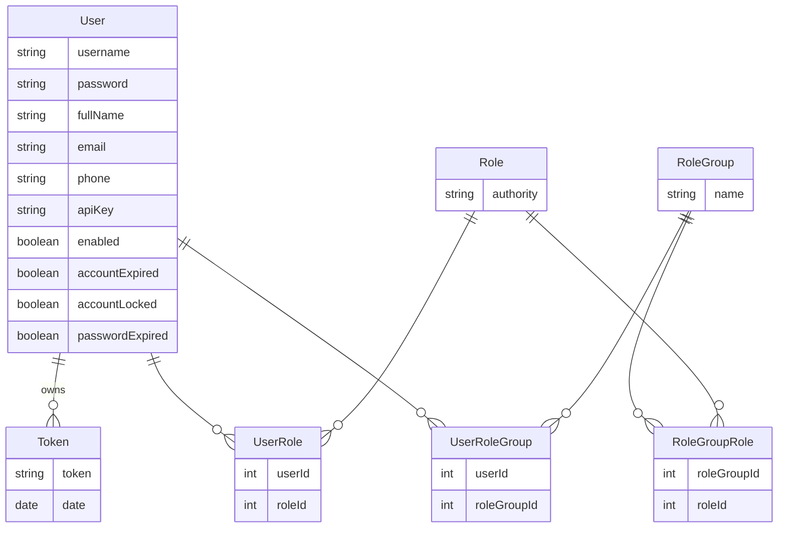

# User & Authentication

```mermaid
erDiagram
    User {
        string username
        string password
        string fullName
        string email
        string phone
        string apiKey
        boolean enabled
        boolean accountExpired
        boolean accountLocked
        boolean passwordExpired
    }
    Role {
        string authority
    }
    RoleGroup {
        string name
    }
    UserRole {
        int userId
        int roleId
    }
    UserRoleGroup {
        int userId
        int roleGroupId
    }
    RoleGroupRole {
        int roleGroupId
        int roleId
    }
    Token {
        string token
        date date
    }

    User ||--o{ UserRole : ""
    Role ||--o{ UserRole : ""
    User ||--o{ UserRoleGroup : ""
    RoleGroup ||--o{ UserRoleGroup : ""
    RoleGroup ||--o{ RoleGroupRole : ""
    Role ||--o{ RoleGroupRole : ""
    User ||--o{ Token : "owns"
```
