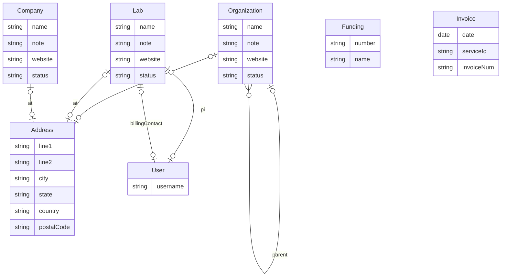

# Organization

> `Lab` and `Company` extend `Organization`, inheriting: name, note, website, status, parent, address.

```mermaid
erDiagram
    Organization {
        string name
        string note
        string website
        string status
    }
    Lab {
        string name
        string note
        string website
        string status
    }
    Company {
        string name
        string note
        string website
        string status
    }
    Address {
        string line1
        string line2
        string city
        string state
        string country
        string postalCode
    }
    User {
        string username
    }
    Funding {
        string number
        string name
    }
    Invoice {
        date date
        string serviceId
        string invoiceNum
    }

    Organization |o--o{ Organization : "parent"
    Organization |o--o| Address : "at"
    Lab |o--o| Address : "at"
    Lab |o--o| User : "pi"
    Lab |o--o| User : "billingContact"
    Company |o--o| Address : "at"
```
