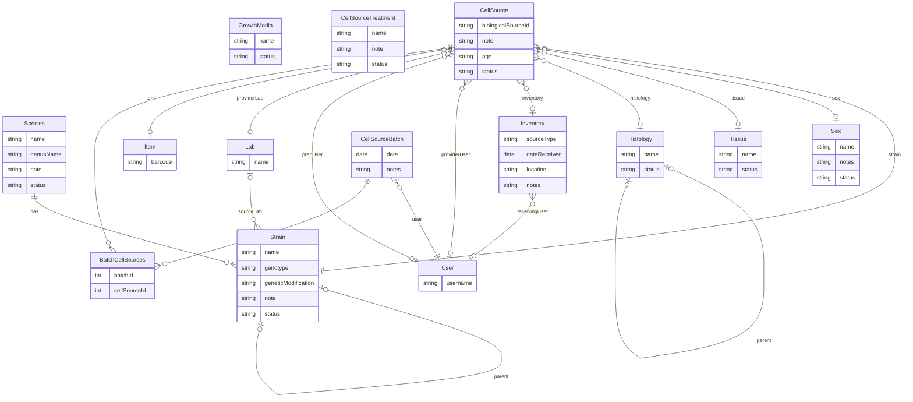

# Biological Sources

```mermaid
erDiagram
    Species {
        string name
        string genusName
        string note
        string status
    }
    Strain {
        string name
        string genotype
        string geneticModification
        string note
        string status
    }
    Sex {
        string name
        string notes
        string status
    }
    Tissue {
        string name
        string status
    }
    Histology {
        string name
        string status
    }
    GrowthMedia {
        string name
        string status
    }
    CellSourceTreatment {
        string name
        string note
        string status
    }
    Inventory {
        string sourceType
        date dateReceived
        string location
        string notes
    }
    CellSource {
        string biologicalSourceId
        string note
        string age
        string status
    }
    CellSourceBatch {
        date date
        string notes
    }
    BatchCellSources {
        int batchId
        int cellSourceId
    }
    Lab {
        string name
    }
    User {
        string username
    }
    Item {
        string barcode
    }

    Species ||--o{ Strain : "has"
    Strain |o--o| Strain : "parent"
    Lab |o--o{ Strain : "sourceLab"
    CellSource }o--|| Strain : "strain"
    CellSource }o--o| Sex : "sex"
    CellSource }o--o| Tissue : "tissue"
    CellSource }o--o| Histology : "histology"
    CellSource }o--o| Inventory : "inventory"
    CellSource }o--o| User : "providerUser"
    CellSource }o--o| User : "prepUser"
    CellSource }o--o| Lab : "providerLab"
    CellSource }o--o| Item : "item"
    Histology |o--o| Histology : "parent"
    Inventory }o--o| User : "receivingUser"
    CellSourceBatch }o--|| User : "user"
    CellSourceBatch ||--o{ BatchCellSources : ""
    CellSource ||--o{ BatchCellSources : ""
```
