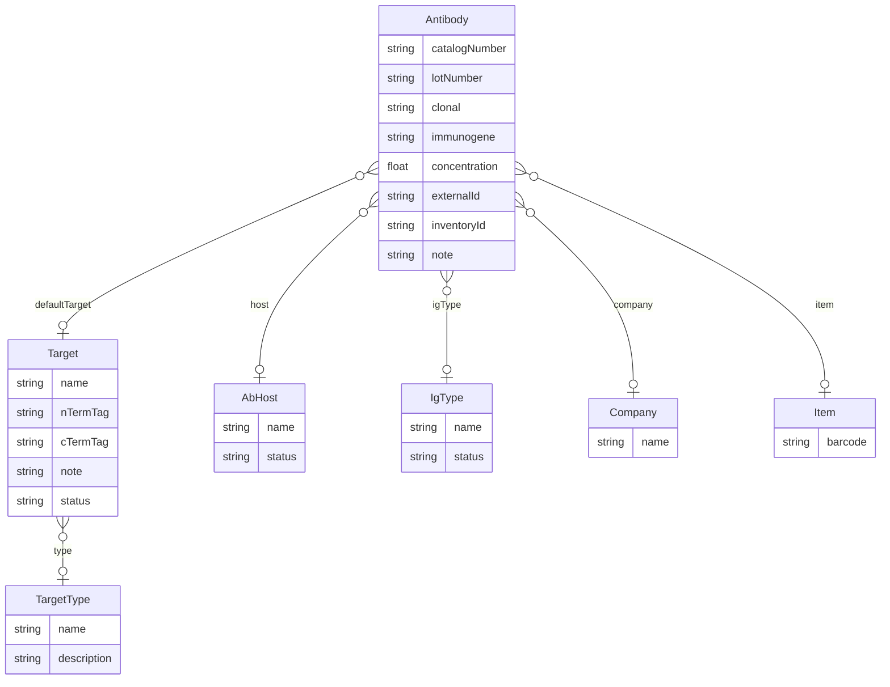

# Target & Antibody

```mermaid
erDiagram
    TargetType {
        string name
        string description
    }
    Target {
        string name
        string nTermTag
        string cTermTag
        string note
        string status
    }
    AbHost {
        string name
        string status
    }
    IgType {
        string name
        string status
    }
    Antibody {
        string catalogNumber
        string lotNumber
        string clonal
        string immunogene
        float concentration
        string externalId
        string inventoryId
        string note
    }
    Company {
        string name
    }
    Item {
        string barcode
    }

    Target }o--o| TargetType : "type"
    Antibody }o--o| AbHost : "host"
    Antibody }o--o| IgType : "igType"
    Antibody }o--o| Company : "company"
    Antibody }o--o| Target : "defaultTarget"
    Antibody }o--o| Item : "item"
```
