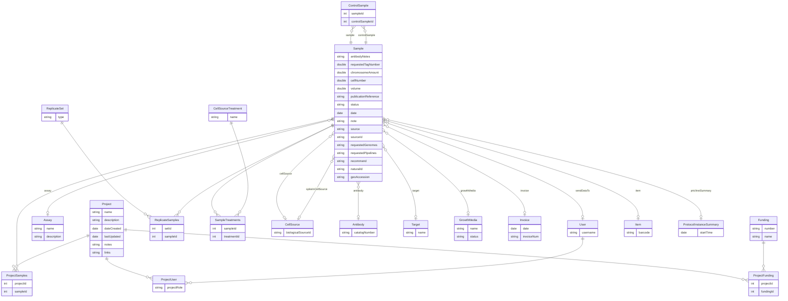

# Sample & Project

```mermaid
erDiagram
    Project {
        string name
        string description
        date dateCreated
        date lastUpdated
        string notes
        string links
    }
    Assay {
        string name
        string description
    }
    Funding {
        string number
        string name
    }
    Sample {
        string antibodyNotes
        double requestedTagNumber
        double chromosomeAmount
        double cellNumber
        double volume
        string publicationReference
        string status
        date date
        string note
        string source
        string sourceId
        string requestedGenomes
        string requestedPipelines
        string recommend
        string naturalId
        string geoAccession
    }
    ReplicateSet {
        string type
    }
    ProjectSamples {
        int projectId
        int sampleId
    }
    ProjectUser {
        string projectRole
    }
    ProjectFunding {
        int projectId
        int fundingId
    }
    ReplicateSamples {
        int setId
        int sampleId
    }
    ControlSample {
        int sampleId
        int controlSampleId
    }
    SampleTreatments {
        int sampleId
        int treatmentId
    }
    CellSourceTreatment {
        string name
    }
    CellSource {
        string biologicalSourceId
    }
    Antibody {
        string catalogNumber
    }
    Target {
        string name
    }
    GrowthMedia {
        string name
        string status
    }
    Invoice {
        date date
        string invoiceNum
    }
    User {
        string username
    }
    Item {
        string barcode
    }
    ProtocolInstanceSummary {
        date startTime
    }

    Project ||--o{ ProjectSamples : ""
    Sample ||--o{ ProjectSamples : ""
    Project ||--o{ ProjectUser : ""
    User ||--o{ ProjectUser : ""
    Project ||--o{ ProjectFunding : ""
    Funding ||--o{ ProjectFunding : ""
    ReplicateSet ||--o{ ReplicateSamples : ""
    Sample ||--o{ ReplicateSamples : ""
    Sample }o--o| CellSource : "cellSource"
    Sample }o--o| CellSource : "spikeInCellSource"
    Sample }o--o| Antibody : "antibody"
    Sample }o--o| Target : "target"
    Sample }o--o| Assay : "assay"
    Sample }o--o| GrowthMedia : "growthMedia"
    Sample }o--o| Invoice : "invoice"
    Sample }o--o| User : "sendDataTo"
    Sample }o--o| Item : "item"
    Sample }o--o| ProtocolInstanceSummary : "prtclInstSummary"
    Sample ||--o{ SampleTreatments : ""
    CellSourceTreatment ||--o{ SampleTreatments : ""
    ControlSample }o--|| Sample : "sample"
    ControlSample }o--|| Sample : "controlSample"
```
