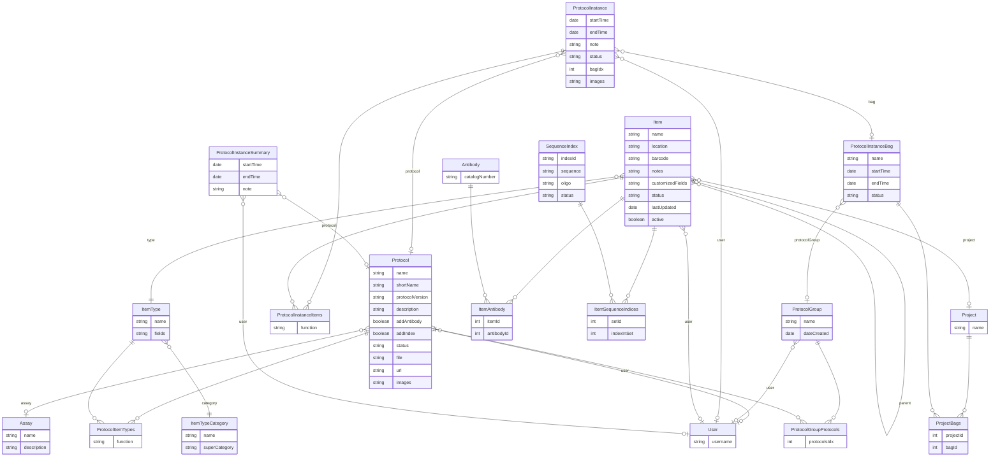

# Protocol & Lab Workflow

```mermaid
erDiagram
    Assay {
        string name
        string description
    }
    Protocol {
        string name
        string shortName
        string protocolVersion
        string description
        boolean addAntibody
        boolean addIndex
        string status
        string file
        string url
        string images
    }
    ProtocolGroup {
        string name
        date dateCreated
    }
    ProtocolGroupProtocols {
        int protocolsIdx
    }
    ProtocolInstanceBag {
        string name
        date startTime
        date endTime
        string status
    }
    ProtocolInstance {
        date startTime
        date endTime
        string note
        string status
        int bagIdx
        string images
    }
    ProtocolInstanceSummary {
        date startTime
        date endTime
        string note
    }
    ProtocolInstanceItems {
        string function
    }
    ProtocolItemTypes {
        string function
    }
    ItemTypeCategory {
        string name
        string superCategory
    }
    ItemType {
        string name
        string fields
    }
    Item {
        string name
        string location
        string barcode
        string notes
        string customizedFields
        string status
        date lastUpdated
        boolean active
    }
    ItemAntibody {
        int itemId
        int antibodyId
    }
    ItemSequenceIndices {
        int setId
        int indexInSet
    }
    SequenceIndex {
        string indexId
        string sequence
        string oligo
        string status
    }
    ProjectBags {
        int projectId
        int bagId
    }
    Project {
        string name
    }
    User {
        string username
    }
    Antibody {
        string catalogNumber
    }

    Protocol }o--o| Assay : "assay"
    Protocol }o--o| User : "user"
    ProtocolGroup }o--o| User : "user"
    ProtocolGroup ||--o{ ProtocolGroupProtocols : ""
    Protocol ||--o{ ProtocolGroupProtocols : ""
    ProtocolInstanceBag }o--o| ProtocolGroup : "protocolGroup"
    ProtocolInstance }o--o| Protocol : "protocol"
    ProtocolInstance }o--o| User : "user"
    ProtocolInstance }o--o| ProtocolInstanceBag : "bag"
    ProtocolInstance ||--o{ ProtocolInstanceItems : ""
    Item ||--o{ ProtocolInstanceItems : ""
    Protocol ||--o{ ProtocolItemTypes : ""
    ItemType ||--o{ ProtocolItemTypes : ""
    ItemType }o--|| ItemTypeCategory : "category"
    Item }o--|| ItemType : "type"
    Item |o--o{ Item : "parent"
    Item }o--o| User : "user"
    Item }o--o| Project : "project"
    Item ||--o{ ItemAntibody : ""
    Antibody ||--o{ ItemAntibody : ""
    Item ||--o{ ItemSequenceIndices : ""
    SequenceIndex ||--o{ ItemSequenceIndices : ""
    ProtocolInstanceSummary }o--o| User : "user"
    ProtocolInstanceSummary }o--o| Protocol : "protocol"
    Project ||--o{ ProjectBags : ""
    ProtocolInstanceBag ||--o{ ProjectBags : ""
```
