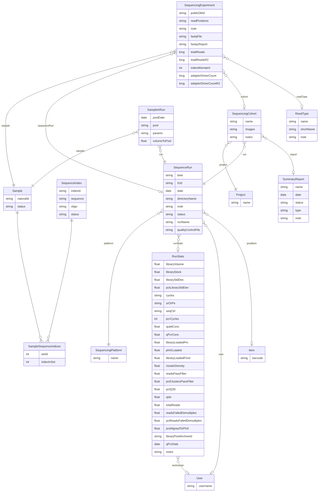

# Sequencing

```mermaid
erDiagram
    SequencingPlatform {
        string name
    }
    RunStats {
        float libraryVolume
        float libraryStock
        float libraryStdDev
        float pctLibraryStdDev
        string cycles
        string srOrPe
        string seqCtrl
        int pcrCycles
        float qubitConc
        float qPcrConc
        float libraryLoadedPm
        float phiXLoaded
        float libraryLoadedFmol
        float clusterDensity
        float readsPassFilter
        float pctClustersPassFilter
        float pctQ30
        float qidx
        float totalReads
        float readsFailedDemultiplex
        float pctReadsFailedDemultiplex
        float pctAlignedToPhiX
        string libraryPoolArchiveId
        date qPcrDate
        string notes
    }
    SequenceRun {
        string lane
        string fcId
        date date
        string directoryName
        string note
        string status
        string runName
        string qualityControlFile
    }
    ReadType {
        string name
        string shortName
        string note
    }
    SequencingExperiment {
        string publicDbId
        string readPositions
        string note
        string fastqFile
        string fastqcReport
        long totalReads
        long totalReadsR2
        int indexMismatch
        long adapterDimerCount
        long adapterDimerCountR2
    }
    SequencingCohort {
        string name
        string images
        string notes
    }
    SampleInRun {
        date poolDate
        string pool
        string params
        float volumeToPool
    }
    SequenceIndex {
        string indexId
        string sequence
        string oligo
        string status
    }
    SampleSequenceIndices {
        int setId
        int indexInSet
    }
    SummaryReport {
        string name
        date date
        string status
        string type
        string note
    }
    Sample {
        string naturalId
        string status
    }
    Project {
        string name
    }
    Item {
        string barcode
    }
    User {
        string username
    }

    SequenceRun }o--|| SequencingPlatform : "platform"
    SequenceRun }o--o| RunStats : "runStats"
    SequenceRun }o--o| User : "user"
    SequenceRun }o--o| Item : "poolItem"
    RunStats }o--o| User : "technician"
    SequencingExperiment }o--|| Sample : "sample"
    SequencingExperiment }o--o| SequenceRun : "sequenceRun"
    SequencingExperiment }o--o| SequencingCohort : "cohort"
    SequencingExperiment }o--o| ReadType : "readType"
    SequencingCohort }o--|| Project : "project"
    SequencingCohort }o--|| SequenceRun : "run"
    SequencingCohort }o--o| SummaryReport : "report"
    SampleInRun }o--|| Sample : "sample"
    SampleInRun }o--|| SequenceRun : "run"
    Sample ||--o{ SampleSequenceIndices : ""
    SequenceIndex ||--o{ SampleSequenceIndices : ""
```
