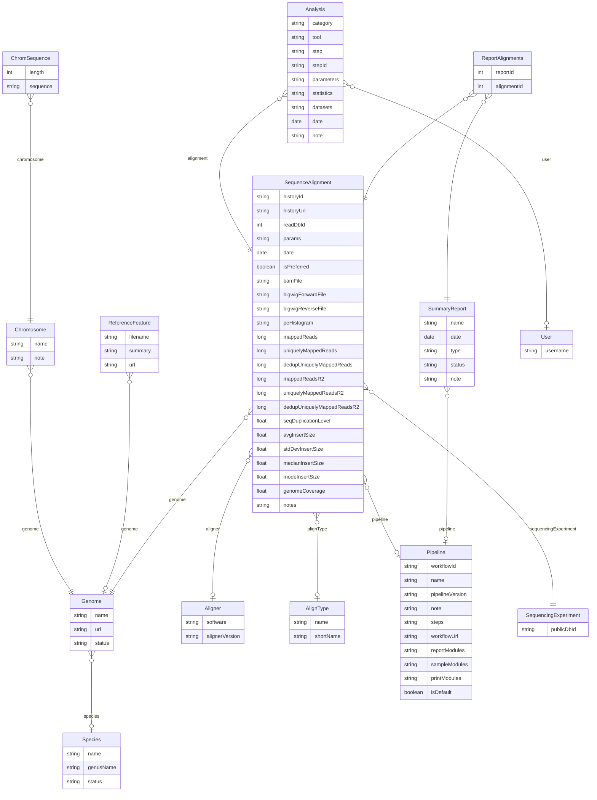

# Genomics & Analysis

```mermaid
erDiagram
    Species {
        string name
        string genusName
        string status
    }
    Genome {
        string name
        string url
        string status
    }
    Chromosome {
        string name
        string note
    }
    ChromSequence {
        int length
        string sequence
    }
    Aligner {
        string software
        string alignerVersion
    }
    AlignType {
        string name
        string shortName
    }
    Pipeline {
        string workflowId
        string name
        string pipelineVersion
        string note
        string steps
        string workflowUrl
        string reportModules
        string sampleModules
        string printModules
        boolean isDefault
    }
    ReferenceFeature {
        string filename
        string summary
        string url
    }
    SequenceAlignment {
        string historyId
        string historyUrl
        int readDbId
        string params
        date date
        boolean isPreferred
        string bamFile
        string bigwigForwardFile
        string bigwigReverseFile
        string peHistogram
        long mappedReads
        long uniquelyMappedReads
        long dedupUniquelyMappedReads
        long mappedReadsR2
        long uniquelyMappedReadsR2
        long dedupUniquelyMappedReadsR2
        float seqDuplicationLevel
        float avgInsertSize
        float stdDevInsertSize
        float medianInsertSize
        float modeInsertSize
        float genomeCoverage
        string notes
    }
    Analysis {
        string category
        string tool
        string step
        string stepId
        string parameters
        string statistics
        string datasets
        date date
        string note
    }
    SummaryReport {
        string name
        date date
        string type
        string status
        string note
    }
    ReportAlignments {
        int reportId
        int alignmentId
    }
    SequencingExperiment {
        string publicDbId
    }
    User {
        string username
    }

    Genome }o--o| Species : "species"
    Chromosome }o--|| Genome : "genome"
    ChromSequence }o--|| Chromosome : "chromosome"
    ReferenceFeature }o--o| Genome : "genome"
    SequenceAlignment }o--|| SequencingExperiment : "sequencingExperiment"
    SequenceAlignment }o--|| Genome : "genome"
    SequenceAlignment }o--o| Pipeline : "pipeline"
    SequenceAlignment }o--o| Aligner : "aligner"
    SequenceAlignment }o--o| AlignType : "alignType"
    Analysis }o--|| SequenceAlignment : "alignment"
    Analysis }o--o| User : "user"
    SummaryReport }o--o| Pipeline : "pipeline"
    ReportAlignments }o--|| SummaryReport : ""
    ReportAlignments }o--|| SequenceAlignment : ""
```
